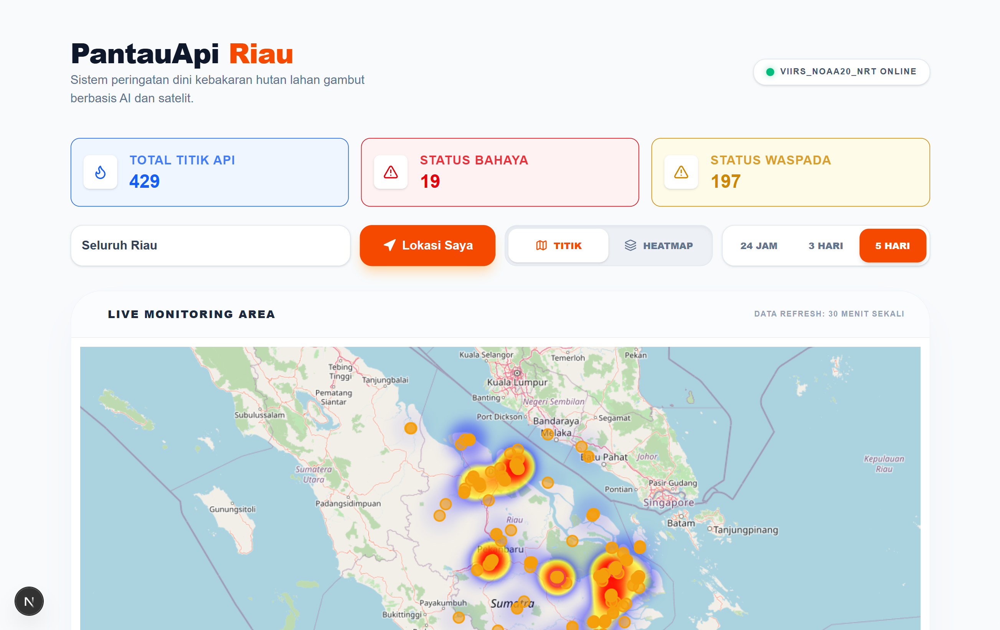
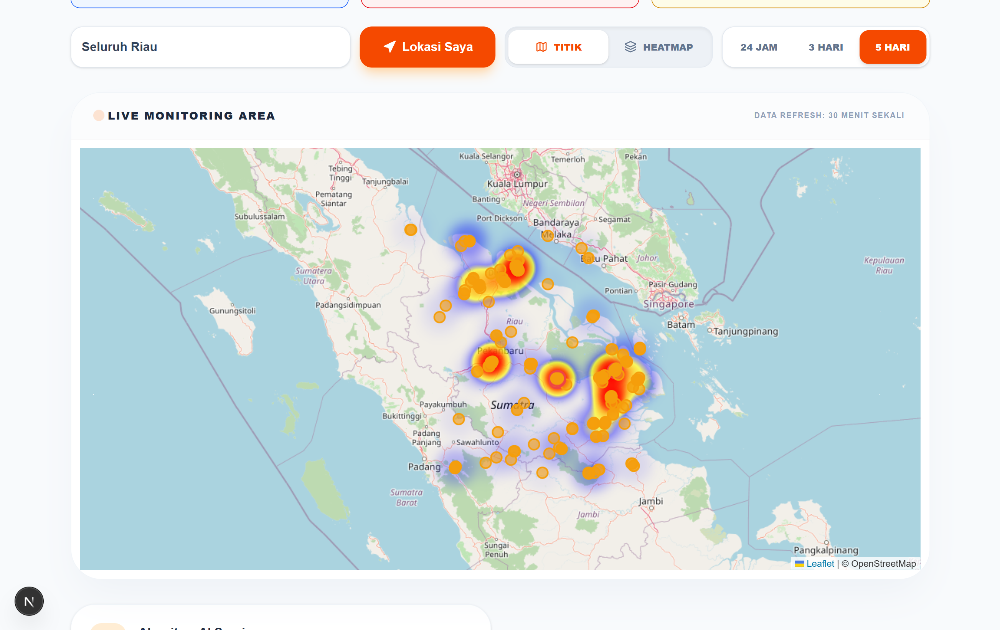
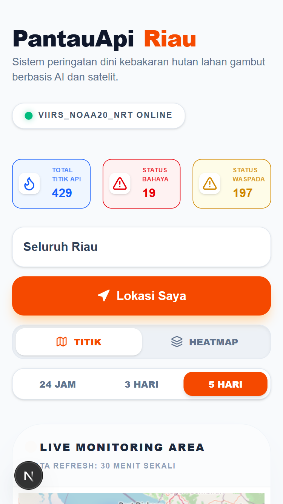
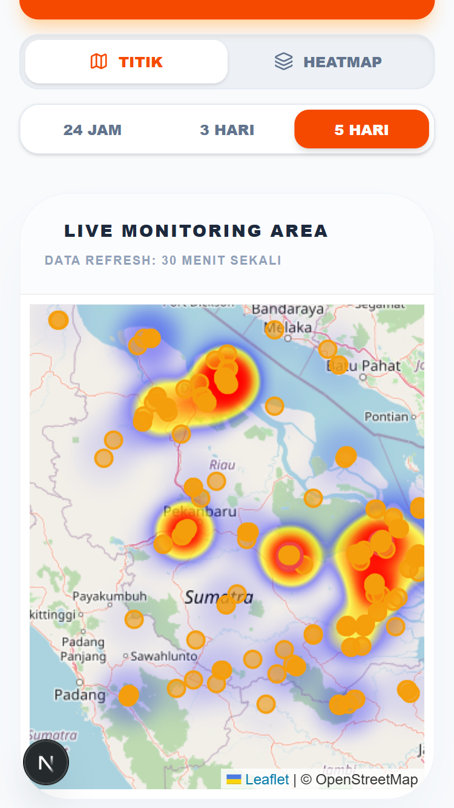

# <p align="center" > PantauApi Riau</p>

<p align="center">
<strong>Sistem Peringatan Dini Karhutla Berbasis AI & Data Satelit NASA</strong>
</p>

<p align="center">
<a href="https://pantauapi-riau.vercel.app"><strong>Live Demo »</strong></a>
<br />
<br />


</p>

---

## 📌 Deskripsi Proyek

PantauApi Riau adalah solusi digital untuk mitigasi bencana kebakaran hutan dan lahan (Karhutla) di Provinsi Riau. Aplikasi ini mengintegrasikan data titik panas (hotspot) dari satelit secara real-time dan menggunakan logika AI Scoring untuk memberikan penilaian risiko yang akurat bagi masyarakat dan petugas di lapangan.

---

## ✨ Fitur Utama

- 🧠 **AI Fire Risk Scoring**: Mengolah data suhu sensor satelit dan tingkat kepercayaan menggunakan algoritma normalisasi untuk menentukan status **BAHAYA**, **WASPADA**, atau **AMAN**.
- 🗺️ **Dual-Mode Interactive Map**:
  - **Mode Titik**: Visualisasi akurat koordinat hotspot dengan informasi detail (suhu, waktu akuisisi, skor risiko).
  - **Mode Heatmap**: Visualisasi kepadatan titik api untuk analisis area kritis (cluster).
- ⚡ **Smart Server Caching**: Mengoptimalkan performa dan kuota API NASA dengan sistem cache otomatis selama 30 menit berdasarkan rentang waktu data.
- ⏳ **Time-Range Filter**: Memungkinkan pengguna melihat data hotspot dari 24 jam terakhir hingga 5 hari ke belakang.
- 📍 **Geolocation "Sekitar Saya"**: Fitur GPS instan untuk memeriksa potensi ancaman api di lokasi pengguna saat ini.
- 📱 **PWA Ready**: Dapat diinstal di perangkat mobile (Android/iOS) dan diakses layaknya aplikasi native.

---

## 🛠️ Tech Stack

- **Framework**: [Next.js](https://nextjs.org/) (App Router)
- **Styling**: [Tailwind CSS](https://tailwindcss.com/)
- **Maps**: [React-Leaflet](https://react-leaflet.js.org/) & [Leaflet.heat](https://github.com/Leaflet/Leaflet.heat)
- **Icons**: [Lucide React](https://lucide.dev/)
- **Data Source**: [NASA FIRMS API](https://firms.modaps.eosdis.nasa.gov/api/) (Satelit VIIRS NOAA-20)
- **Deployment**: [Vercel](https://vercel.com/)

---

## 🧠 Logika AI Scoring

Aplikasi menggunakan pendekatan _Heuristic Expert System_ untuk menentukan tingkat bahaya. Skor risiko ($Risk$) dihitung dengan rumus bobot normalisasi:

$$Risk = (T_{norm} \times 0.7) + (C_{norm} \times 0.3)$$

Di mana:

- $T_{norm}$: Suhu sensor satelit yang telah dinormalisasi terhadap ambang batas kritis (300K - 380K).
- $C_{norm}$: Tingkat kepercayaan satelit (0 - 1).
- Bobot $70\%$ diberikan pada suhu karena merupakan indikator paling valid di lahan gambut Riau.

---

## 📷 Dokumentasi Produk

### Desktop View

Tampilan dashboard luas untuk pemantauan intensif oleh petugas admin atau analis.

<p align="center">


</p>

### Mobile View & PWA

Optimasi antarmuka untuk penggunaan di lapangan oleh relawan dan masyarakat.

<p align="center">


</p>

---

## 🚀 Instalasi Lokal

1.  Clone repository:

    ```bash
    git clone [https://github.com/kamaldev10/pantauapi-riau.git](https://github.com/kamaldev10/pantauapi-riau.git)
    cd pantauapi-riau
    ```

2.  Instal dependensi:

    ```bash
    npm install
    ```

3.  Setup Environment Variables (`.env.local`):
    Dapatkan API Key di [NASA FIRMS](https://firms.modaps.eosdis.nasa.gov/api/map_key/)

    ```env
    NASA_FIRMS_KEY=your_api_key_here
    ```

4.  Jalankan aplikasi:
    ```bash
    npm run dev
    ```
    Buka [http://localhost:3001](http://localhost:3001) pada browser Anda.

---

© 2026 PantauApi Riau. Dikembangkan untuk masa depan Riau yang bebas asap. 🌿
